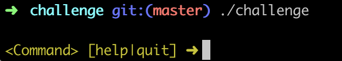
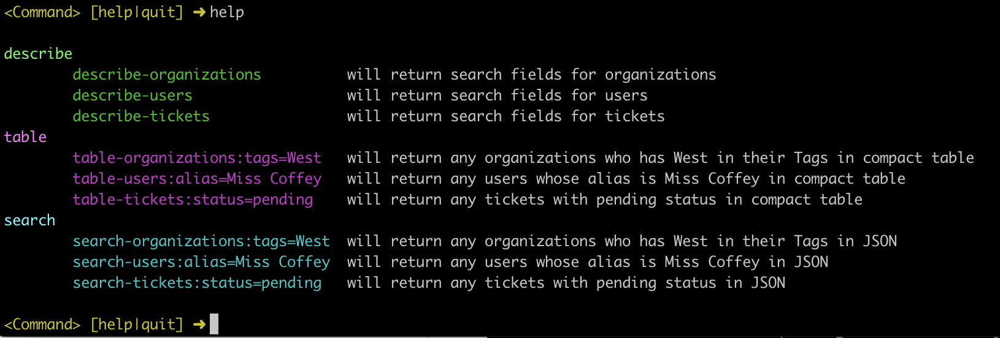
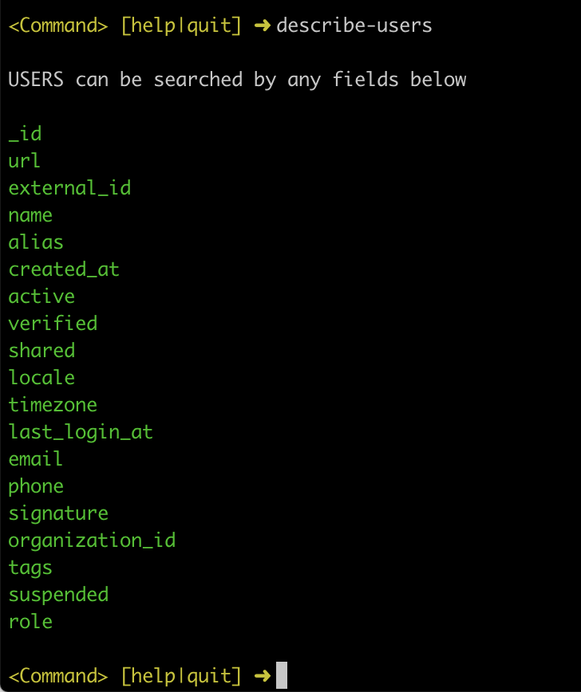
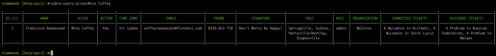
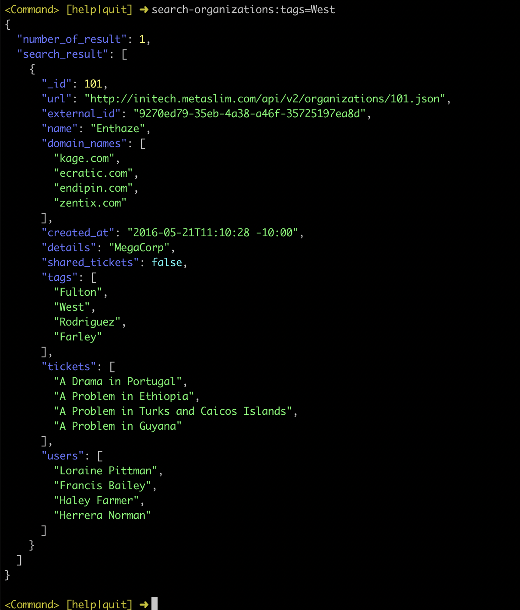

# Simple Code Challenge

Currently this app is using Go internal library (encoding/json) which uses reflection. This can be improved by using library which does not use reflection such as easyjson (https://github.com/mailru/easyjson). 

## Environment

Go 1.12

## Caveats

1. List of searchable fields is extracted from the first record in each json files.

2. Search term must be exact match, which means it will only accept time format as defined in json (2016-06-07T09:18:00 -10:00)

3. No auto complete for search term.

4. The app will ignore invalid commands and will only respond to a valid command.

5. https://appliedgo.net/generics/

## Setting up locally

### GOPATH and installing the code
```
$ mkdir -p $HOME/Development/gocode
$ export GOPATH=$HOME/Development/gocode
$ go get -v github.com/metaslim/challenge
$ cd $GOPATH/src/github.com/metaslim/challenge
$ git status
On branch master
Your branch is up to date with 'origin/master'.

nothing to commit, working tree clean
```

### Install Dependencies
```sh
$ make install
```

## How to run tests

```sh
$ make test

```

## How to build binary

```sh
$ make build
```

## How to run binary

```sh
$ ./challenge
```

## How to run without compiling (slower compared to run binary)

```sh
$ make run
```

### Main Menu


### Get Help


### Display Search Fields


### Search and display result in compact table


### Search and display result in colored json


### Exit

