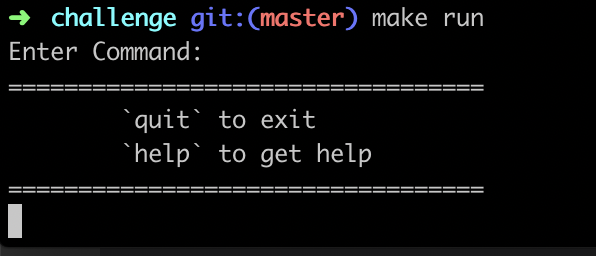
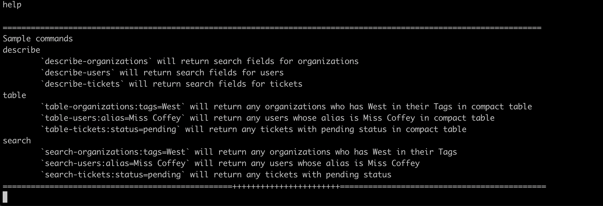
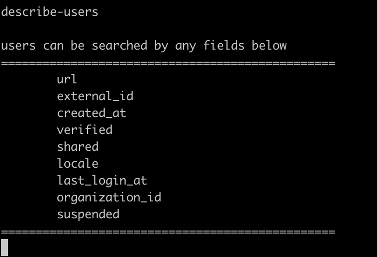
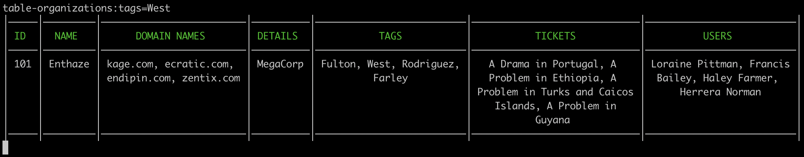
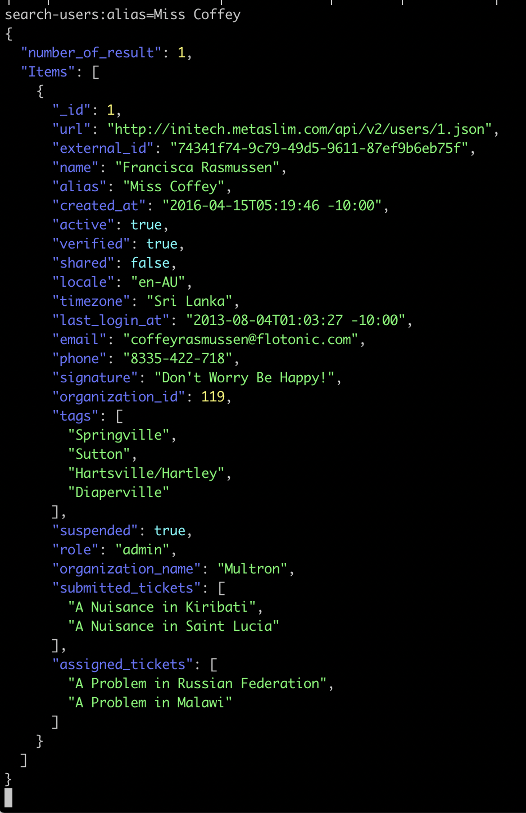

# Simple Code Challenge

## How it looks like

#### Main Menu


#### Help


#### Display Search Field


#### Search and display in compact table


#### Search and display in json


#### Quit


## Setting up locally

#### Install Dependencies
```sh
make install
```

#### Run Tests
```sh
make test

```

#### Run App
```sh
make run
```

#### Command
```
"quit" to exit
"help" to get help

"describe-organizations" will return search fields for organizations
"describe-users" will return search fields for users
"describe-tickets" will return search fields for tickets

"table-organizations:tags=West" will return any organizations who has West in their Tags in compact table
"table-users:alias=Miss Coffey" will return any users whose alias is Miss Coffey in compact table
"table-tickets:status=pending" will return any tickets with pending status  in compact table

"search-organizations:tags=West" will return any organizations who has West in their Tags
"search-users:alias=Miss Coffey" will return any users whose alias is Miss Coffey
"search-tickets:status=pending" will return any tickets with pending status
```

Currently this app is using Go internal library (encoding/json) which use reflection. In the future parsing json file should able to be improved with https://github.com/mailru/easyjson without reflection.