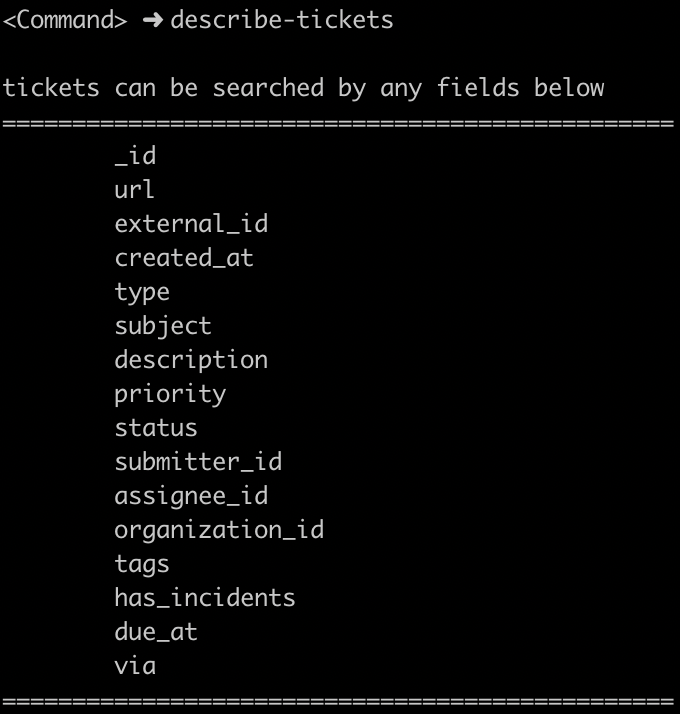

# Simple Code Challenge

Currently this app is using Go internal library (encoding/json) which uses reflection. This can be improved by using library which does not use reflection such as easyjson (https://github.com/mailru/easyjson).

## Environment

Go 1.12.3

## Setting up locally

### GOPATH and installing the code
```
$ export GOPATH=/Users/someone/Development/gocode
$ export PATH=$GOPATH/bin:$PATH
$ echo $GOPATH
/Users/someone/Development/gocode
$ go get github.com/metaslim/challenge
$ cd $GOPATH/src/github.com/metaslim/challenge
$ pwd
/Users/someone/Development/gocode/src/github.com/metaslim/challenge
$ git status
On branch master
Your branch is up to date with 'origin/master'.

nothing to commit, working tree clean
```

### Install Dependencies
```sh
make install
```

## How to run tests

```sh
make test

```

## How to run

```sh
make run
```

### Main Menu


### Get Help


### Display Search Field


### Search and display in compact table


### Search and display in json


### Exit

